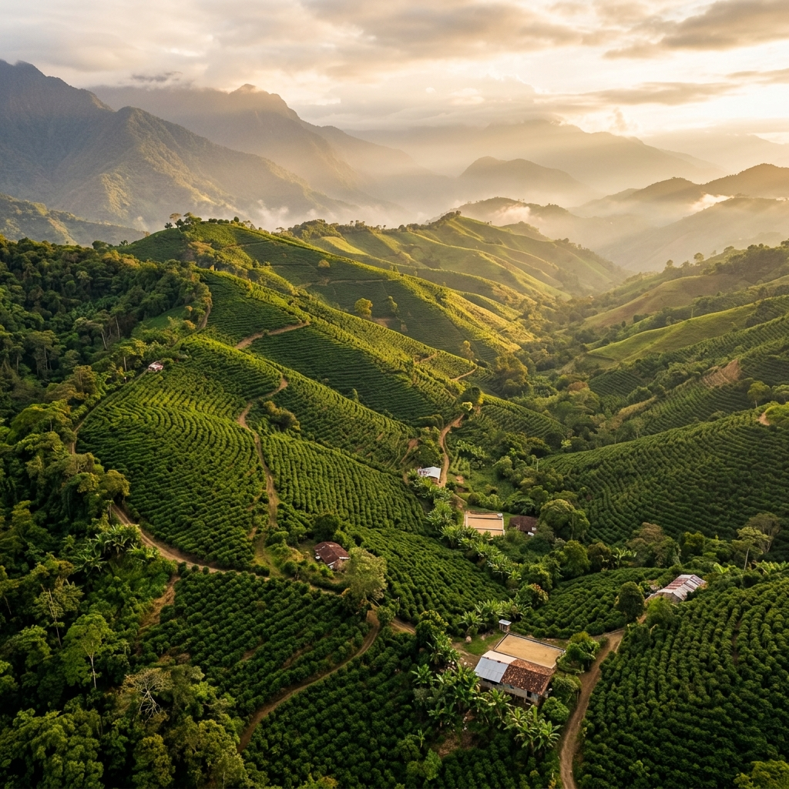

# ☕ Valle Blanco — Café de Origen

<div align="center">

  

<br/><br/>

[](https://naisnow12.github.io/Proyecto_CafeValleBlanco/)
[](https://developer.mozilla.org/es/docs/Web/HTML)
[](https://developer.mozilla.org/es/docs/Web/CSS)
[](https://developer.mozilla.org/es/docs/Web/JavaScript)
[](https://developer.mozilla.org/es/docs/Learn/CSS/CSS_layout/Responsive_Design)

  <p align="center">
    <strong>Sitio web institucional y catálogo digital para café de origen producido en Villa Rica, Oxapampa, Perú.</strong>
  </p>

  <p align="center">
    <a href="https://naisnow12.github.io/Proyecto_CafeValleBlanco/"><strong>🌐 Ver Sitio Web en Vivo</strong></a>
  </p>

</div>

---

## 📖 Descripción del Proyecto

**Valle Blanco** es un proyecto web desarrollado para una empresa familiar dedicada al cultivo, procesamiento y comercialización de café de alta calidad en **Villa Rica, provincia de Oxapampa (Pasco, Perú)**.

El objetivo del sitio web es transmitir la tradición, autenticidad y el meticuloso proceso detrás de cada grano de café, ofreciendo a los visitantes una experiencia visual inmersiva, elegante y totalmente responsiva.

> 🎓 **Contexto Académico:** Proyecto desarrollado para el curso de **Herramientas de Desarrollo**.

---

## 🚀 Demo en Vivo (GitHub Pages)

El proyecto se encuentra publicado y accesible de forma gratuita a través de GitHub Pages en el siguiente enlace:

👉 **[https://naisnow12.github.io/Proyecto_CafeValleBlanco/](https://naisnow12.github.io/Proyecto_CafeValleBlanco/)**

---

## ✨ Características Principales

- 📱 **Diseño 100% Responsivo:** Adaptado para dispositivos móviles, tablets y pantallas de escritorio.
- 🎨 **Estética Visual Premium:** Paleta de colores cálidos y terrosos inspirados en el café, tipografías refinadas y maquetación limpia.
- ✨ **Animaciones y Microinteracciones:**
  - Efectos de aparición con scroll (_Scroll Reveal_) mediante `IntersectionObserver`.
  - Efecto de desplazamiento sutil (_Parallax_) en secciones destacadas.
  - Barra interactiva de progreso para las etapas de producción del café.
  - Menú de navegación móvil dinámico (animación _hamburguesa_).
- 🧭 **Navegación Modular y Fluida:**
  - Desplazamiento suave (_smooth scroll_) para enlaces de ancla.
  - Resaltado dinámico del enlace activo en el menú de navegación.
- 📝 **Formulario de Contacto:** Con validación de campos y formato de correo electrónico mediante JavaScript.
- ⚡ **Rendimiento Óptimo:** Código nativo sin librerías pesadas, garantizando tiempos de carga veloces.

---

## 📂 Estructura del Proyecto

```text
Proyecto_CafeValleBlanco/
│
├── index.html                 # Página principal (Landing Page)
├── README.md                  # Documentación del proyecto
│
├── Html/                      # Páginas secundarias del sitio
│   ├── nosotros.html          # Historia, identidad y valores
│   ├── cafe.html              # Origen, variedades y notas de cata
│   ├── proceso.html           # Etapas del cultivo y procesamiento del café
│   ├── Galeria.html           # Galería fotográfica de las plantaciones
│   └── Contacto.html          # Formulario de contacto y ubicación
│
├── css/
│   └── styles.css             # Estilos globales, diseño responsive y temas
│
├── js/
│   └── main.js                # Lógica interactiva, observers y validaciones
│
└── img/                       # Recursos visuales y fotografías del café
    ├── hero.png
    ├── harvest.png
    ├── origin.png
    ├── cherries.png
    ├── drying.png
    ├── beans.png
    ├── cup.png
    ├── gallery-plantation.png
    └── Valle-Rica-Oxapampa.png
```

---

## 📄 Secciones y Páginas del Sitio

| Página                         | Descripción                                                                                                |
| :----------------------------- | :--------------------------------------------------------------------------------------------------------- |
| **Inicio (`index.html`)**      | Presentación de la marca, lema, resumen de identidad y acceso a todas las secciones.                       |
| **Nosotros (`nosotros.html`)** | Conexión familiar con la tierra de Villa Rica, misión y pasión cafetalera.                                 |
| **Nuestro Café (`cafe.html`)** | Detalle de las variedades (Caturra, Typica), altitud y atributos organolépticos.                           |
| **Proceso (`proceso.html`)**   | Explicación paso a paso: cosecha manual, despulpado, fermentación, secado y tostado con barra de progreso. |
| **Galería (`Galeria.html`)**   | Álbum fotográfico que ilustra el trabajo en los cafetales y el grano en sus distintas fases.               |
| **Contacto (`Contacto.html`)** | Formulario de consulta, datos de contacto y enlaces a canales de atención.                                 |

---

## 🛠️ Tecnologías Utilizadas

- **HTML5:** Estructura semántica accesible (`<header>`, `<nav>`, `<main>`, `<section>`, `<footer>`, `<article>`).
- **CSS3:**
  - Variables personalizadas (_CSS Custom Properties_) para tokens de diseño.
  - Flexbox y CSS Grid para layouts adaptativos.
  - Media queries para optimización móvil.
  - Animaciones y transiciones fluidas.
- **JavaScript (ES6+):**
  - Manejo del DOM y eventos.
  - API `IntersectionObserver` para animaciones progresivas al deslizar la página.
  - Validación de formularios con expresiones regulares (RegEx).
- **GitHub Pages:** Despliegue continuo y hosting del sitio estático.

---

## 💻 Instalación y Ejecución Local

Para visualizar y probar el proyecto en tu entorno local:

1. **Clonar el repositorio:**

   ```bash
   git clone https://github.com/Naisnow12/Proyecto_CafeValleBlanco.git
   ```

2. **Acceder a la carpeta del proyecto:**

   ```bash
   cd Proyecto_CafeValleBlanco
   ```

3. **Abrir en el navegador:**
   - Puedes abrir directamente el archivo `index.html` en tu navegador favorito haciendo doble clic sobre él.
   - O utilizar una extensión como **Live Server** en Visual Studio Code para recarga automática en tiempo real.

---

## 👥 Créditos y Autores

- **Autores:** Grupo 03
- **Curso:** Herramientas de Desarrollo

---

<div align="center">
  <sub>Desarrollado con ☕ y pasión por el café peruano de Villa Rica, Oxapampa.</sub>
</div>
